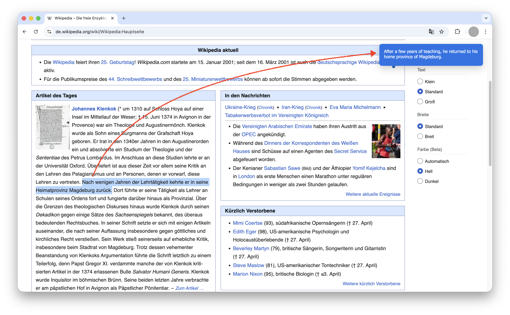

# Swift translator
## Super fast translator Google chrome extension

A chrome extenion to translate heighlitet text immidiately using Built-in chrome AI Translate.

## How to test it locally:

1. Clone the repo
2. Go to [chrome://extensions](chrome://extensions) on Google Chrome (or similar Chromium browser)
3. Turn the **Developer mode** on
4. Click on **Load Unpack** and upload the `src` folder
5. Go to any German website and highlight any text, it will be translated using your local machine 

> [!NOTE]  
> The first time it takes longer as it downlaods the LLM model.

> [!WARNING]  
> The [Chrome Translator API](https://developer.chrome.com/docs/ai/translator-api) is in experimental mode and might change in future.
