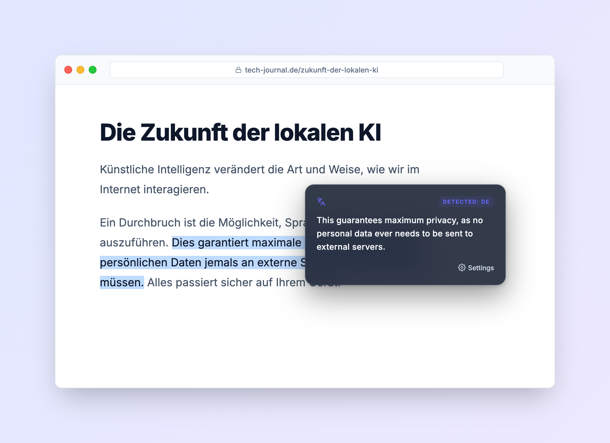

# Swift Translator ⚡️

A high-performance, 100% private, beautifully designed Chrome extension that translates text instantly using your browser's built-in Local AI.

## Features
- **Lightning Fast**: Powered by Chrome's experimental built-in AI Translation API.
- **100% Private**: Translations happen locally on your device. Absolutely no text is sent to external servers.
- **Glassmorphic UI**: A premium, drag-and-drop enabled interface with smooth animations and a dynamic theme engine.
- **Smart Language Detection**: Automatically detects the source language of your highlighted text.
- **RTL Support**: Seamlessly handles Right-to-Left languages like Arabic and Hebrew.

## Getting Started

1. **Enable the API**: Go to `chrome://flags/#translation-api` and enable the Translation API. Restart Chrome.
2. **Install**: Open `chrome://extensions`, enable **Developer mode**, and select **Load unpacked**. Choose the `src` folder.
3. **Use**: Highlight any text on any webpage to see the translation instantly.

## Documentation
For full instructions, troubleshooting, and configuration details, please see the [Full Guide](./docs/guide.md).

## Architecture
- `content.js`: Injects the translation UI, handles drag-and-drop, theme application, and communicates with the Local AI models.
- `options.js` & `options.html`: A full-page, responsive dashboard for managing your preferences, built with modern CSS grids.
- `background.js`: Handles service worker tasks and persistent state management.
